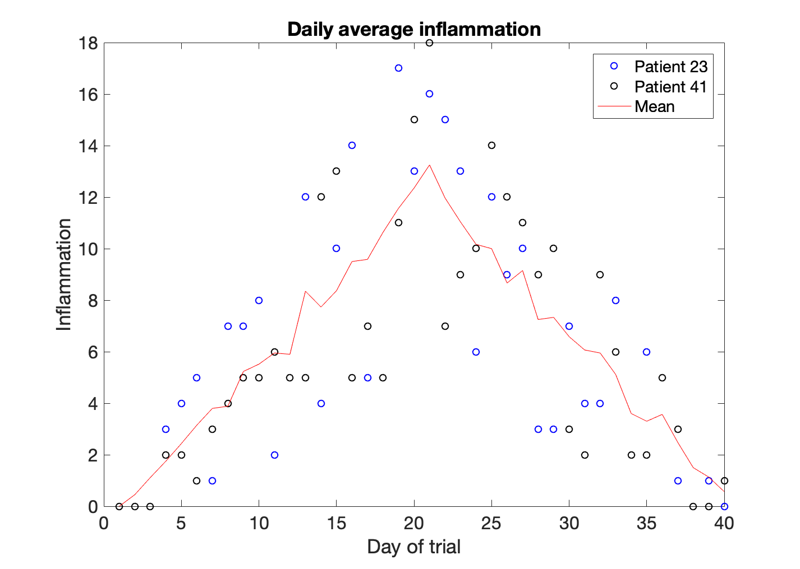

## Plotting
The mathematician Richard Hamming once said,
"The purpose of computing is insight, not numbers," and the best
way to develop insight is often to visualize data. Visualization
deserves an entire lecture (or course) of its own, but we can
explore a few features of MATLAB here.

Let's display a heat map of our data:

~~~
>> imagesc(patient_data)
>> title('Inflammation')
>> xlabel('Day of trial')
>> ylabel('Patient number')
~~~
{: .language-matlab}


The `imagesc` function represents the matrix as a color image. Every
value in the matrix is *mapped* to a color. Blue regions in this heat map
are low values, while yellow shows high values.
As we can see,
inflammation rises and falls over a 40 day period.

It's good practice to give the figure a `title`,
and to label the axes using `xlabel` and `ylabel`
so that other people can understand what it shows
(including us if we return to this plot 6 months from now).

Now let's look at other properties of the data. Let's calculate the average. 
Averages are calculated in MATLAB with the `mean` function. To get details about what a function, like `mean`,
does and how to use it, we can search the documentation, or use MATLAB's `help` command.

~~~
>> help mean
~~~
{: .language-matlab}

~~~
mean   Average or mean value.
    S = mean(X) is the mean value of the elements in X if X is a vector. 
    For matrices, S is a row vector containing the mean value of each 
    column. 
    For N-D arrays, S is the mean value of the elements along the first 
    array dimension whose size does not equal 1.
 
    mean(X,DIM) takes the mean along the dimension DIM of X.
 
    S = mean(...,TYPE) specifies the type in which the mean is performed, 
    and the type of S. Available options are:
 
    'double'    -  S has class double for any input X
    'native'    -  S has the same class as X
    'default'   -  If X is floating point, that is double or single,
                   S has the same class as X. If X is not floating point, 
                   S has class double.
 
    S = mean(...,NANFLAG) specifies how NaN (Not-A-Number) values are 
    treated. The default is 'includenan':
 
    'includenan' - the mean of a vector containing NaN values is also NaN.
    'omitnan'    - the mean of a vector containing NaN values is the mean 
                   of all its non-NaN elements. If all elements are NaN,
                   the result is NaN.
 
    Example:
        X = [1 2 3; 3 3 6; 4 6 8; 4 7 7]
        mean(X,1)
        mean(X,2)
 
    Class support for input X:
       float: double, single
       integer: uint8, int8, uint16, int16, uint32,
                int32, uint64, int64
 
    See also median, std, min, max, var, cov, mode.
~~~
{: .output}

First we need to decide what we want. Do we need the maximum inflammation for *all* patients, or the
average for each day?

To support this, MATLAB allows us to specify the *dimension* we
want to work on. If we want an average inflammation over time, this means that we will want MATLAB to calculate the average of each column. In MATLAB DIM=1 means that the operation is performed for each column, while DIM=2 means that the operation is performed for each row.


As we can see when we read the help information for `mean`, the default for the `mean` function is average over columns, so we can skip the dimension argument in this case. We can also indicate a dimension argument equal to 1: 

~~~
>> mean(patient_data, 1)
~~~
{: .language-matlab}

~~~
ans =
  Columns 1 through 10
         0    0.5833    0.9833    1.6667    2.5333    3.0667    3.4667    3.9000    5.2333    5.1833
  Columns 11 through 20
    6.2167    6.4000    7.2167    8.0500    8.8667    9.6333   10.1833   10.1500   10.4167    9.8667
  Columns 21 through 30
   12.2000   12.1000   11.1833   11.0333   10.0000    8.5167    8.3833    8.5167    8.1167    6.2500
  Columns 31 through 40
    5.7667    5.6000    5.1333    3.9000    3.7000    2.7833    2.5500    1.2833    0.9667    0.6000
~~~
{: .output}

As a quick check, we can check the size of this array:

~~~
>> size(mean(patient_data, 1))
~~~
{: .language-matlab}

~~~
ans =
    1    40
~~~
{: .output}

The size tells us we have a 1-by-40 vector, so this is the average
inflammation per day for all patients. If we average across axis 2, we
get:

~~~
>> mean(patient_data, 2)
~~~
{: .language-matlab}

~~~
ans =

   5.4500
   5.4250
   6.1000
   5.9000
   5.5500
   6.2250
   5.9750
   6.6500
   6.6250
   6.5250
   6.7750
   5.8000
   6.2250
   5.7500
   5.2250
   6.3000
   6.5500
   5.7000
   5.8500
   6.5500
   5.7750
   5.8250
   6.1750
   6.1000
   5.8000
   6.4250
   6.0500
   6.0250
   6.1750
   6.5500
   6.1750
   6.3500
   6.7250
   6.1250
   7.0750
   5.7250
   5.9250
   6.1500
   6.0750
   5.7500
   5.9750
   5.7250
   6.3000
   5.9000
   6.7500
   5.9250
   7.2250
   6.1500
   5.9500
   6.2750
   5.7000
   6.1000
   6.8250
   5.9750
   6.7250
   5.7000
   6.2500
   6.4000
   7.0500
   5.9000
~~~
{: .output}

which is the average inflammation per patient across
all days.


Let's work on plotting this information, now.

~~~
>> patient_mean = mean(patient_data,1));
>> plot(patient_mean)
>> title('Daily average inflammation')
>> xlabel('Day of trial')
>> ylabel('Inflammation')
~~~
{: .language-matlab}


> ## Plots
>
> When we plot just one variable using the `plot` command e.g. `plot(Y)` 
> what do the x-values represent?
>
> > ## Solution
> > The x-values are the indices of the y-data, so the first y-value is plotted
> > against index 1, the second y-value against 2 etc.
> {: .solution}
>
> Let's imagine that the data were not taken at regular intervals of one day, but
> pretend that inflammation was measured once a day during the first 20 days 
> and every other day for the last 40 days. We can create this vector by using the following  
> commands:
> xvector = [[1:20],[22:2:60]];
> Can you plot patient_mean vs the new time vector? Hint: check `help plot`
>
> > ## Solution
> > ```
> > >> plot(xvector,patient_mean)
> > >> title('Daily average inflammation')
> > >> xlabel('Day of trial')
> > >> ylabel('Inflammation')
> > ```
> > {: .language-matlab}
> {: .solution}
>
> Create a plot showing the standard deviation of the inflammation data for each day across all patients.
> Hint: search the documentation for *standard deviation*
>
> > ## Solution
> > ```
> > >> plot(std(patient_data, 0, 2))
> > >> xlabel('Day of trial')
> > >> ylabel('Inflammation')
> > >> title('Standard deviation across all patients')
> > ```
> > {: .language-matlab}
> {: .solution}
{: .challenge}


As you can see, MATLAB uses a line plot as default. Sometimes a line plot is not the best way of visualizing your data. 

~~~
>> plot(patient_mean,'*')
>> title('Daily average inflammation')
>> xlabel('Day of trial')
>> ylabel('Inflammation')
~~~
{: .language-matlab}


In this figure the data is shown as stars. This is because we included the line specifier `'*'`. We can specify the line color, the marker style, and the line style. For example, if we wanted to plot a dashed line (`'--'`) with circles as markers (`'o'`) in red (`'r'`) we would write:

~~~
>> plot(patient_mean,'or--')
>> title('Daily average inflammation')
>> xlabel('Day of trial')
>> ylabel('Inflammation')
~~~
{: .language-matlab}


The line specifiers can be positioned in any order. To learn more about all the options available, you can search for LineSpec in the Matlab help. 

> ## Plots
>
> Can you create a plot of the patient average where the markers are diamonds, the line is dotted, and the color magenta?
>
> > ## Solution
> > ```
> > >> plot(patient_mean,'dm:')
> > >> title('Daily average inflammation')
> > >> xlabel('Day of trial')
> > >> ylabel('Inflammation')
> > ```
> > {: .language-matlab}
> {: .solution}
>
> We want to customize even more the look of our plot. We want our markers to be larger than the default, of size 12, and our 
> solid black line to be thick, 3pt thick. We would also want our markers (upward-pointing triangles) to have a filling color (red) different than the edge (black). Hint: take a look at the LineSpec instructions in the Matlab help, and read the Related Properties section. 
>
> > ## Solution
> > ```
> > >> plot(patient_mean,'-k^',...
    'LineWidth',3,...
    'MarkerEdgeColor','k',...
    'MarkerFaceColor','r',...
    'MarkerSize',12)
> > >> title('Daily average inflammation')
> > >> xlabel('Day of trial')
> > >> ylabel('Inflammation')
> > ```
> > {: .language-matlab}
> {: .solution}
{: .challenge}


Until now we have seen that every time that we use the plot function our figure resets. However, we may want to show several sets of plots in the same axis. For example, we could be interested in comparing the inflammation of a couple of individual patients with the mean. 

~~~
>> plot(patient_data(23,:),'bo')
>> hold on
>> plot(patient_data(41,:),'ko')
>> plot(patient_mean,'r')
>> hold off
>> title('Daily average inflammation')
>> xlabel('Day of trial')
>> ylabel('Inflammation')
~~~
{: .language-matlab}


In this case we have plotted the inflammation values of patient number 23 as blue circles, and the inflammation values of patient 41 as black circles. The average is a solid red line. In order to understand the graph we need to add a legend. 

~~~
>> legend('Patient 23','Patient 41', 'Mean')
~~~
{: .language-matlab}



One of the things we discovered when playing with the data is that the average of the inflammation is roughly a linear rise and fall, which is suspicious: based on other studies, we expect a sharper rise and slower fall. We suspect that something is wrong with our first data file. We would like to check the other 11 the same way,
but typing in the same commands repeatedly is tedious and error-prone.
Since computers don't get bored (that we know of), we should create a
way to do a complete analysis with a single command, and then figure out
how to repeat that step once for each file. These operations are the
subjects of the next two lessons.
